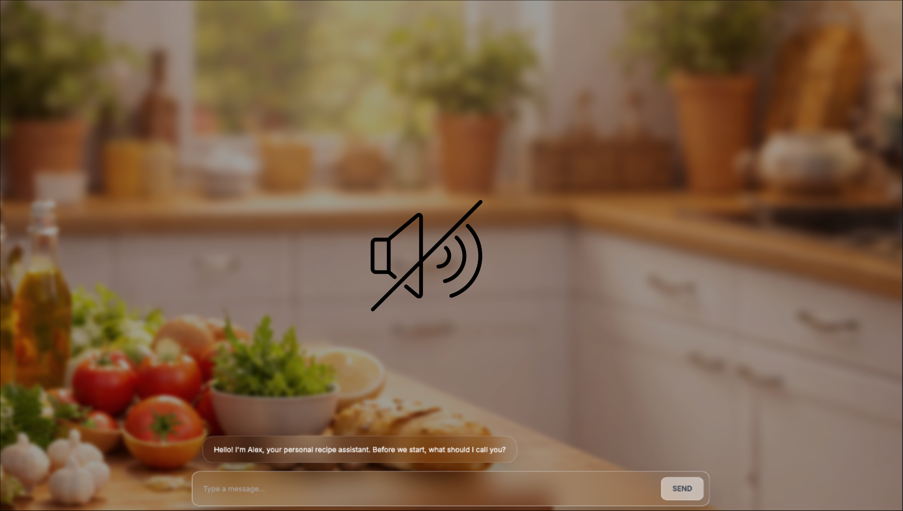

# ECA Study

A research study comparing two AI-powered recipe recommendation agents: a text-based chatbot and an embodied conversational agent (ECA) with a 3D animated avatar. Participants interact with one of the two agents to find healthy recipes and complete surveys across two phases.

---

## Conditions

### Chatbot — [`Chatbot/`](Chatbot/)
A text-based conversational agent. Participants chat through a browser interface to receive personalised healthy recipe recommendations.

### ECA (Embodied Conversational Agent) — [`ECA/`](ECA/)
A 3D animated avatar that speaks responses aloud using text-to-speech and lip-sync. Functionally identical to the Chatbot condition but delivered through an embodied agent.

Both conditions share the same conversation flow, recipe dataset, and survey instruments.

---

## Demo

<video src="clip.mp4" controls width="100%"></video>

---

## Getting Started

See the README inside each condition's folder for setup and deployment instructions.
